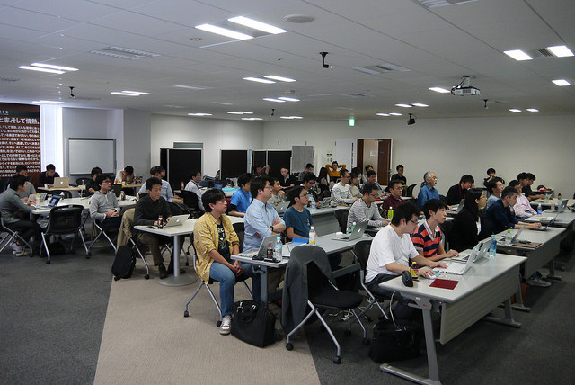
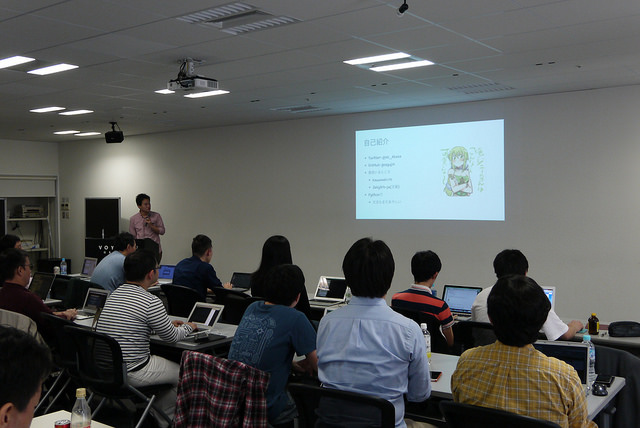
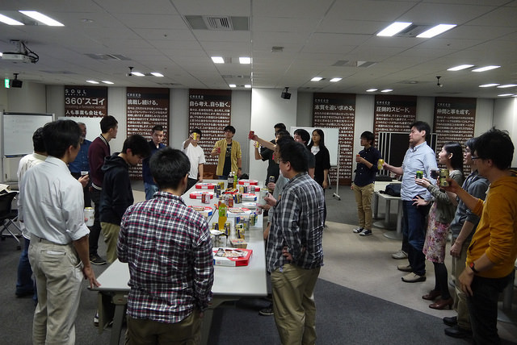

SphinxCon JP 2014 (2014/10/26)
===============================

SphinxCon JP 2014 は多くの方にご参加いただき、盛況のうちに終了しました。
当日の総参加者は 43名でした(スタッフ、発表者含む)。

これまで :doc:`2012年 <../20120916_sphinxconjp/index>` 、:doc:`2013年 <../20130223_sphinxconjp/index>` と、他のイベントと併催してきたSphinxCon JPですが、今回は単独イベントとして開催されました。

.. image:: SphinxConJP2014-logo.png
   :align: center
   :width: 580
   :height: 93
   :alt: SphinxCon 2014 logo

.. contents::
   :local:

開催概要
----------

すぐれたドキュメントツールである Sphinx を使って、あなたのドキュメントを書いてみませんか。 Sphinx は多くの OSS のマニュアル、リファレンスで採用されている他、 IT企業でも利用されはじめています。 ドキュメントを作りたくなってしまうとまで言われる Sphinx の魅力を皆さんにご紹介します。

今年の SphinxCon JP のテーマは **Sphinxをはじめよう** です。

Sphinxをまだ本格的に使っていない方にとっては、新たなドキュメンテーションツールとの出会いを提供したいと思います。また、Sphinxを既に使っている方には、他の人のプレゼンテーションや会場での交流等を通じて、新しい使い方を知るきっかけになればと思います。

本イベントでは、セミナー(発表形式)・ハンズオン(Sphinx入門)・ハッカソン(各自自由に手を動かす)の組み合わせで、これから Sphinx を始めてみたい方や実際に運用を始めている方に向けて Sphinx の魅力をお伝えします。

:日時: 2014/10/26(日)
:場所: `VOYAGE GROUP様`_ (東京都渋谷区神泉町8-16渋谷ファーストプレイス８Ｆ)
:参加費: 無料
:交通:
   * JR山手線 渋谷駅より徒歩15分, 京王井の頭線 神泉駅より徒歩3分
   * `[アクセスマップ]`_ `[GoogleMap]`_
   * ご来場の際は公共交通機関をご利用下さい

.. _VOYAGE GROUP様: http://voyagegroup.com/company/access/
.. _[アクセスマップ]: http://voyagegroup.com/company/access/
.. _[GoogleMap]: https://www.google.co.jp/maps/place/VoyageGroup/@35.6553195,139.6937795,17z/data=!3m1!4b1!4m2!3m1!1s0x60188b55a7bf82b7:0xb0fd4271fd87016?hl=ja

タイムテーブル 2014/10/26 (日)
-------------------------------

全体
   * 09:30 - 10:00 開場
   * 10:00 - 10:10 会場案内など
   * 10:10 - 12:30 ハッカソン、ハンズオン (並行開催)
   * 12:30 - 14:00 自由時間(お昼)、ハッカソン
   * 14:00 - 17:40 セミナー

     * 14:00 - 14:25 :ref:`Welcome to Sphinx-1.3 (清水川) <sphinxconjp2014_seminar01>`
     * 14:25 - 14:50 :ref:`SIerでもSphinxを使いたい！総括 (kk_Ataka) <sphinxconjp2014_seminar02>`
     * 14:50 - 15:15 :ref:`SphinxとLaTeXで作る英文マニュアル (力武 健次) <sphinxconjp2014_seminar03>`
     * 15:15 - 15:25 休憩
     * 15:25 - 15:50 :ref:`Markdownもはじめよう (高橋征義) <sphinxconjp2014_seminar04>`
     * 15:50 - 16:15 :ref:`Sphinx拡張 探訪 2014 (小宮 健 (@tk0miya)) <sphinxconjp2014_seminar05>`
     * 16:15 - 16:25 休憩
     * 16:25 - 16:50 :ref:`検索エンジンOktavia (渋川よしき) <sphinxconjp2014_seminar06>`
     * 16:50 - 17:40 :ref:`Sphinx HTML Theme Hacks (shkumagai) <sphinxconjp2014_seminar07>`

   * 17:40 - 17:50 クロージング
   * 18:00 - 20:00 懇親会(無料)＆LT(成果発表など)
   * 20:00 - 20:00 閉会

ハンズオン
~~~~~~~~~~~
:持ち物: PC, 事前に http://sphinx-users.jp/gettingstarted/index.html を参考に Sphinx のインストールをお願いします
:ネットワーク: ネットワークが必要な方は、モバイルルータをご持参ください
:電源: 会場の電源を利用可能 (タップ持参を推奨)
:飲食: 自由
:途中入退場: 可

ハッカソン
~~~~~~~~~~~
Sphinx-users.jp が毎月開催している、ディスカッションやコーディングを
自由に行うことのできるイベントの出張版です。
自由入退出可ですので、PC をお持ちになって一緒に Sphinx を使ってみましょう。
自分でやりたいテーマや聞きたいことを持ち寄って、楽しくハックしましょう。

:持ち物: PC、ハックするテーマ もしくは聞きたいこと
:ネットワーク: ネットワークが必要な方は、モバイルルータをご持参ください
:電源: 会場の電源を利用可能 (タップ持参を推奨)
:飲食: 自由
:途中入退場: 可

セミナー
~~~~~~~~~
Sphinx の使い方、利用事例、広め方やテーマ・拡張の紹介など、
Sphinx 利用者による発表を行います。

.. _sphinxconjp2014_seminar01:

Welcome to Sphinx-1.3
######################
Sphinx-1.3 の見所を紹介します！

Sphinx-1.3 はHTMLにおける検索機能の強化、numfig機能の実装（予定）など大きな機能が追加されていますが、
これら2つの機能は日本からのpull requestが取り込まれたものです。このような大きな機能に加え、さまざまな追加機能について紹介します。

また、内部実装についても大きな変更がありました。Sphinx-1.3 は内部の実装を大きく書き換え、
ソースコード変換なしでPython3に対応しましたが、Python2.4, 2.5 サポートは打ち切りました。
これから、Sphinx-1.4以降ではどの範囲をサポートしていくのか、どうのような機能を追加していくのかについても紹介します。

.. image:: shimizukawa.jpg
   :alt: 清水川

清水川

* @shimizukawa
* http://about.me/shimizukawa
* Sphinx 共同メンテナ
* 書籍 「Sphinxをはじめよう」 共著
* Sphinx-users.jp 副会長
* Python mini hack-a-thon 運営
* PyCon JP イベント運営・社団法人運営

.. raw:: html

     <iframe width="560" height="420" src="http://shimizukawa.bitbucket.org/sphinxconjp2014-welcome-to-sphinx-1.3/index.html" frameborder="0"></iframe>

.. _sphinxconjp2014_seminar02:

SIerでもSphinxを使いたい！総括
###############################
Office文書が支配する職場でどのようにSphinxを導入するか、
また、導入後のプロジェクトにおいてどのような問題があり
それを解決していったか、あるいは何が足りなくてできなかったかの
報告をしたいと思います。

.. image:: kk_Ataka.jpg
   :alt: kk_Ataka

kk_Ataka

ふつうのSIer

参加プロジェクト: jekyllrb-ja (Rubyの静的サイト生成ツール「Jekyll」の翻訳プロジェクト)

.. raw:: html

   <iframe src="//www.slideshare.net/slideshow/embed_code/40723958" width="425" height="355" frameborder="0" marginwidth="0" marginheight="0" scrolling="no" style="border:1px solid #CCC; border-width:1px; margin-bottom:5px; max-width: 100%;" allowfullscreen> </iframe> 
 <strong> <a href="//www.slideshare.net/kk_Ataka/20141026-sphinx-forsiersummarysiersphinx" title="SIerでもSphinxを使いたい！総括" target="_blank">SIerでもSphinxを使いたい！総括</a> </strong> from <strong><a href="//www.slideshare.net/kk_Ataka" target="_blank">kk_Ataka</a></strong> 

.. _sphinxconjp2014_seminar03:

SphinxとLaTeXで作る英文マニュアル
##################################
A4版200ページほどの日本語から英語への翻訳文書制作にあたり，Sphinxを使うことで，
HTML版とLaTeXを通じたPDF文書の双方を制作する上での作業工程の合理化を図ることができた．
この講演では，実際にどのような作業を行ったか，どのような点に気をつければ良いかについて，簡単に紹介する．

力武 健次

力武健次技術士事務所 所長．1990年からインターネットの仕事に携わる．Erlang/OTP, FreeBSD使い．

.. raw:: html

   

.. _sphinxconjp2014_seminar04:

Markdownもはじめよう
#####################
Sphinx使いのみなさんなら当然ふだんはreSTで生活をされているかと思いますが、
ご存知の通り世の中にはreST以外にも数多くのマークアップ言語があります。
本発表ではその中でも広く使われているマークアップ言語であるMarkdownとそのバリエーションについて、
最近の動向（CommonMarkとか）にも触れながら紹介します。

あと一部Re:VIEWの紹介（宣伝）も入るかもしれません。

.. image:: takahashim.jpg
   :alt: 高橋征義

高橋征義

プログラマ。株式会社達人出版会代表取締役、一般社団法人日本Rubyの会代表理事。Re:VIEWコミッタ。

.. raw:: html

   <iframe src="//www.slideshare.net/slideshow/embed_code/40727178" width="425" height="355" frameborder="0" marginwidth="0" marginheight="0" scrolling="no" style="border:1px solid #CCC; border-width:1px; margin-bottom:5px; max-width: 100%;" allowfullscreen> </iframe> 
 <strong> <a href="//www.slideshare.net/takahashim/sphinx-markdown" title="Markdownもはじめよう" target="_blank">Markdownもはじめよう</a> </strong> from <strong><a href="//www.slideshare.net/takahashim" target="_blank">masayoshi takahashi</a></strong> 

.. _sphinxconjp2014_seminar05:

Sphinx拡張 探訪 2014
#####################
Sphinx(reST) の特徴のひとつとして拡張性があげられます。
Sphinx には様々な開発者によって開発された数多くの拡張が存在し、
ドキュメントを書くもののチカラになってくれます。

このセッションではこうした Sphinx 拡張を時間の許す限り取り上げ、
その特徴や使い道などを紹介します。

.. image:: tk0miya.jpg
   :alt: 小宮 健 (@tk0miya)

小宮 健 (@tk0miya)

(株)タイムインターメディア所属

blockdiag、Sphinx などといったドキュメンテーションツールに興味を持ち、
ツール、拡張モジュールの開発やコミュニティ活動を行なっている。

.. raw:: html

   <iframe src="//www.slideshare.net/slideshow/embed_code/40727933" width="425" height="355" frameborder="0" marginwidth="0" marginheight="0" scrolling="no" style="border:1px solid #CCC; border-width:1px; margin-bottom:5px; max-width: 100%;" allowfullscreen> </iframe> 
 <strong> <a href="//www.slideshare.net/TakeshiKomiya/sphinx-2014" title="Sphinx拡張 探訪 2014 #sphinxjp" target="_blank">Sphinx拡張 探訪 2014 #sphinxjp</a> </strong> from <strong><a href="//www.slideshare.net/TakeshiKomiya" target="_blank">Takeshi Komiya</a></strong> 

.. _sphinxconjp2014_seminar06:

検索エンジンOktavia
####################
Oktaviaの実装の中身について紹介します。ブラウザで動かすために工夫していること、など。
間に合えば、Sphinx統合についても？

.. image:: shibukawa.jpg
   :alt: 渋川よしき

渋川よしき

Sphinx-Users.jpファウンダー

.. raw:: html

   <iframe src="//www.slideshare.net/slideshow/embed_code/40722231" width="425" height="355" frameborder="0" marginwidth="0" marginheight="0" scrolling="no" style="border:1px solid #CCC; border-width:1px; margin-bottom:5px; max-width: 100%;" allowfullscreen> </iframe> 
 <strong> <a href="//www.slideshare.net/shibukawa/oktavia-sphinxcon" title="Oktavia全文検索エンジン - SphinxCon JP 2014" target="_blank">Oktavia全文検索エンジン - SphinxCon JP 2014</a> </strong> from <strong><a href="//www.slideshare.net/shibukawa" target="_blank">Yoshiki Shibukawa</a></strong> 

.. _sphinxconjp2014_seminar07:

Sphinx HTML Theme Hacks
########################
Sphinxには最初から８つのHTMLテーマが予め入っていて、conf.py で名前を指定するだけで、好みのテーマを適用することができます。
これからSphinxに触れる方や既に触れている方に向けて、ちょいカスタマイズの仕方から独自テーマの作り方、
作成したテーマの配布方法などご紹介します。

shkumagai

株式会社クロスリスティング所属
エンジニアとしてPython, Common Lispを使った広告プラットフォームの開発と運用に従事。Sphinx-Users.jp ヒラ会員

開催報告
---------

写真
~~~~~~

   セミナーの様子 (1)

   40名を超える方が参加し、セミナーの内容に耳を傾けました。

   セミナーの様子 (2)

   7名の方にそれぞれ異なるテーマについて話してもらいました。

   懇親会の様子の様子

   ドリンク片手に Sphinx やドキュメンテーション全般について熱い議論(?)が交わされました。

そのほかの写真はFlickrにまとめてあります。 https://flic.kr/s/aHsk55FLyZ

.. raw:: html

   <iframe width="560" height="420" src="https://www.flickr.com/photos/shimizukawa/sets/72157648579210049/player/" frameborder="0"></iframe>

ツイートまとめ
~~~~~~~~~~~~~~~~~~~~

* `SphinxCon JP 2014 - Togetterまとめ <http://togetter.com/li/737278>`_

.. raw:: html

  
