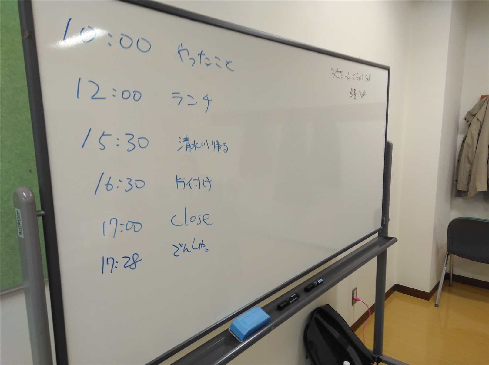
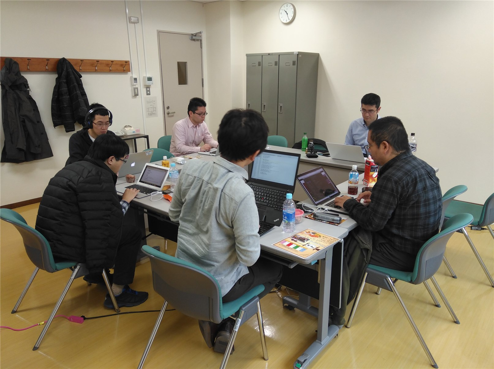
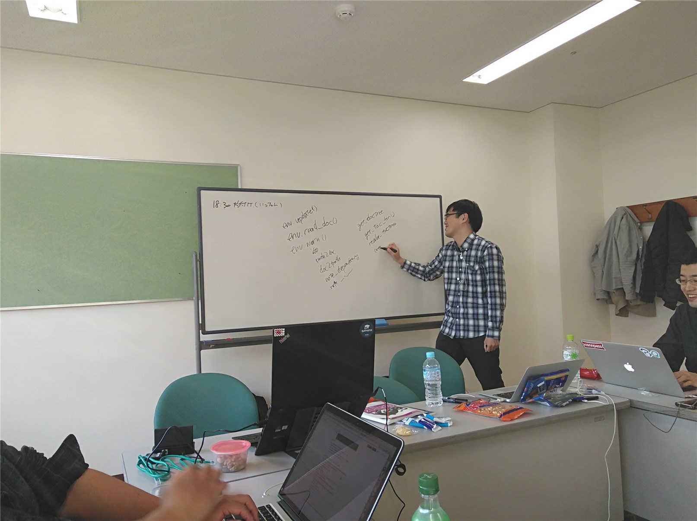
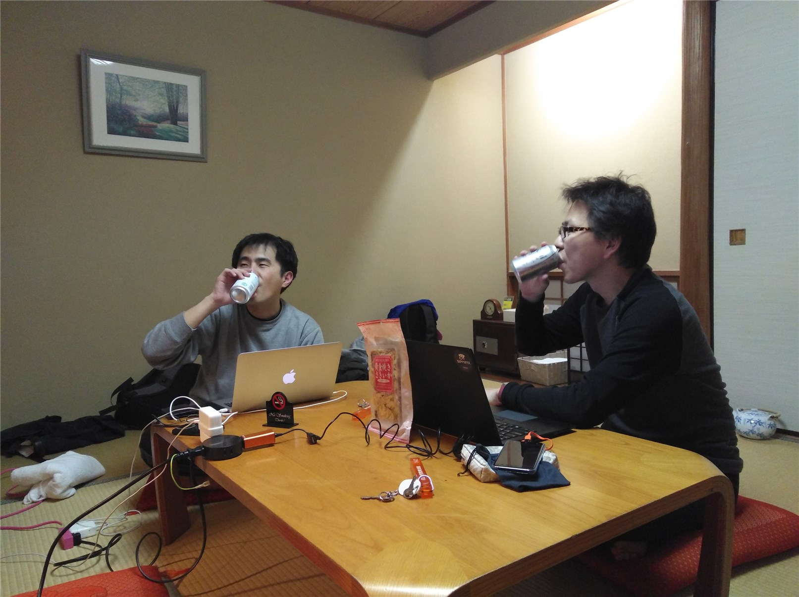

============================================
Sphinx + 翻訳 Hack-a-thon 開発合宿 2018年1月
============================================

:日時: 2018/01/07 ～ 01/08
:場所: 国立女性教育会館

2018 年 1 月 7 日 ～ 1 月 8 日にかけて開発合宿を実施しました。

`connpass <https://sphinxjp.connpass.com/event/72062/>`_ で参加者を募集。

参加レポート
============

* `Hack like a rolling stone: Sphinx 開発合宿をしました。 <http://tk0miya.hatenablog.com/entry/2018/01/12/152034>`_
* `清水川記: Sphinx + 翻訳 hack-a-thon 開発合宿 2018 <http://www.freia.jp/taka/blog/sphinxjp-camp-20180108/index.html>`_
* `プログラマ行進曲第二章 Sphinx + 翻訳 Hack-a-thon 開発合宿に参加してきました <http://takuan-osho.hatenablog.com/entry/2018/01/08/i-joined-sphinx-plus-translation-hackathon-bootcamp>`_
* `kashew_nuts-blog: Sphinx + 翻訳 Hack-a-thon 開発合宿に参加しました <https://kashewnuts.github.io/2018/01/13/sphinxjp_camp.html>`_

合宿の様子
==========

   スケジュール

   ハッカソンの様子

   講義をするメンテナ

   夜は一杯飲みながら
