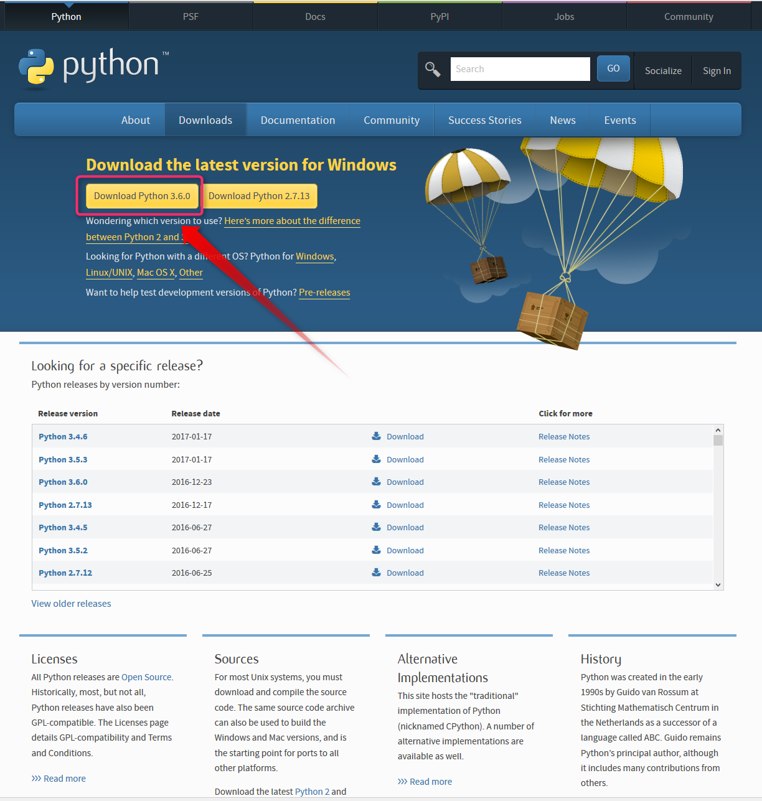
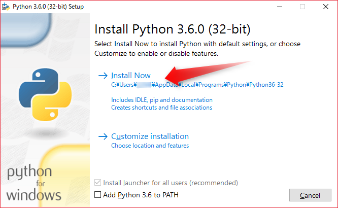
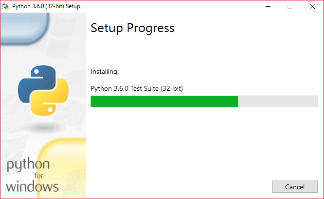
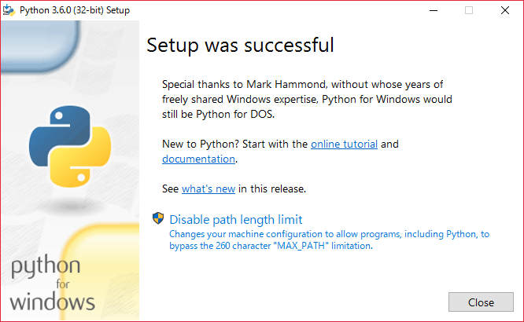

=======================
Windowsへのインストール
=======================

Pythonのインストール
======================

Windowsは、標準でPythonがインストールされていませんので、Pythonのインストールから説明します。

Pythonをインストールする為のPythonディストリビューションやツールにはPyenv、 Anaconda、ActivePython、IronPython等、他にもいくつかありますが、ここでは公式のPythonインストーラを使います。

Pythonの環境構築に慣れている方であればどのディストリビューションを選択しても問題無いと思いますが、Pythonに慣れていない方は複数のPythonのインストールを避け、公式のPythonだけをインストールして下さい。

また、Pythonは2系と3系がありますがPython2はサポートが終了しています。
公式の Python3 の最新版 [#latestpython]_ をインストールしましょう。
以降は Python3 の説明です。

まず https://www.python.org/downloads/ ( :numref:`download-python` ) を開き *Download the latest version for Windows* の下にある *Download Python 3.x.x* をクリック、インストーラをダウンロードして下さい [#installer]_ 。

   Python インストーラのダウンロード

ダウンロードが終わったら、インストーラを実行し、インストールを開始します。
*Add Python 3.x to PATH* のチェックは外してください [#path]_ 。

   インストール開始

*Install Now* ( :numref:`pythoninstaller01` ) の直下に表示されているインストールパスをメモしてから、 *Install Now* クリックします。

   インストール中

   インストール完了ダイアログ

インストールが完了したら *Close* をクリックしてダイアログを閉じましょう。

インストール先を確認しましょう。
:menuselection:`Windowsキー押下 --> cmd と入力し Enter キー押下` でコマンドプロンプトを起動して次のコマンドを打ち結果例のように表示される事を確認して下さい [#cmd]_ 。

  コマンド ::

      cd %USERPROFILE%\AppData\Local\Programs\Python\Python36-32
      dir /w
      # Windows10 の場合は標準のインストールパスは `%USERPROFILE%\AppData\Local\Programs\Python\Python36-32` となります。

  結果例  ::

      [.]                [..]               [DLLs]
      [Doc]              [include]          [Lib]
      [libs]             LICENSE.txt        NEWS.txt
      python.exe         python3.dll        python36.dll
      pythonw.exe        [Scripts]          [tcl]
      [Tools]            vcruntime140.dll

続いてインストールされた Python のバージョンを確認します。引き続きコマンドプロンプトに次のコマンドを打ちましょう

  コマンド

  .. code-block:: bat

      python -V

  表示例

  .. code-block:: bat

      Python 3.6.3

以上でまず Python のインストールが完了しました。次はいよいよ Sphinx のインストールです。

Sphinxのインストール
====================
venv という Python3.3 以降に追加された仮想環境機能を利用して Sphinx 用の環境を作成し、Sphinx をインストールする手順を紹介します。

引き続きコマンドプロンプトにてコマンドを打ちこみます。
まず、 venv 環境をユーザのホームディレクトリ配下に ``mysphinx`` という名前で作成します。

  .. code-block:: bat

      py -m venv %USERPROFILE%\mysphinx

仮想環境に入ります

  .. code-block:: bat

      %USERPROFILE%\mysphinx\Scripts\activate

`pip <https://pip.pypa.io/en/stable/>`_ コマンドでインストールします。コマンドプロンプトに以下のようにタイプしエンターキーを押して下さい。

  .. code-block:: bat

     pip install sphinx Pillow

     # 正常にインストールが完了した場合の表示例
     Successfully installed Jinja2-2.10 MarkupSafe-1.0 Pillow-4.3.0 Pygments-2.2.0 alabaster-0.7.10 babel-2.5.1 certifi-2017.11.5 chardet-3.0.4 colorama-0.3.9 docutils-0.14 idna-2.6 imagesize-0.7.1 olefile-0.44 pytz-2017.3 requests-2.18.4 six-1.11.0 snowballstemmer-1.2.1 sphinx-1.6.5 sphinxcontrib-websupport-1.0.1 urllib3-1.22

Sphinx がインストールされた事を確認しましょう。

  .. code-block:: bat

      sphinx-quickstart --version

     # 正常にインストールが完了した場合の表示例
     Sphinx v2.0.1

インストール作業は以上です。次は :doc:`make_project` に進んでください。

.. note:: Sphinx のバージョンをアップデートする

          Sphinx の新しいバージョンがリリースされた場合、自分の環境も最新にする為には venv 環境に入り下記コマンドを打って下さい ::

             pip install sphinx -U

.. warning:: Python の仮想環境(venv環境)から抜けるには :command:`deactivate` コマンドを打つ必要がありますが :command:`deactivate` を打たずに :command:`exit` でコマンドプロンプトを終了させてしまって問題ありません

.. rubric:: 脚注

.. [#latestpython] 2020年現在は Python3.8 系が最新です

.. [#installer] インストーラは 32bit 版と 64bit 版がありますがよくわからなければ 32bit 版をダウンロードして下さい。

.. [#cmd] コマンドプロンプトに慣れていない方は Web 上で検索すると多くの記事が見つかりますので別途調べて下さい。

.. [#path] 以前は環境変数の PATH に追加する事を推奨していましたが、この記事では意図せず複数の Python をインストールしている場合がある事を考慮し、 PATH に追加せずに venv という Python の仮想環境機能を利用して Sphinx を実行する方法を説明します。
