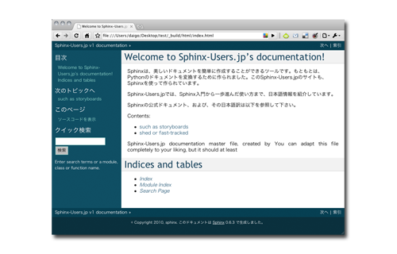

.. トップページ

.. meta::

   :description: Python製ドキュメンテーションビルダー、Sphinxの日本ユーザ会
   :keywords:
      Sphinx,スフィンクス,ドキュメンテーション,ツール,Python,
      reStructuredText,reST

Sphinx-Users.jp
===============

Sphinx-Users.jp(略称#sphinxjp)は、美しいドキュメントを簡単に生成することができるドキュメンテーションツール、 Sphinx_ （スフィンクス）の普及を主眼としたコミュニティです。SphinxはPythonの公式ドキュメントだけでなく、このSphinx-Users.jpのサイトも含め多くのマニュアルやサイトで使用されており、詳細を :doc:`history` で紹介しています。

.. _Sphinx: http://www.sphinx-doc.org/ja/stable/

Sphinx-Users.jpでは、日本で散らばっているSphinx関連情報を集めて、Webサイト、イベントを通じてSphinx情報を発信します。また、\ :ref:`mailinglist`\ での情報交換、\  :doc:`勉強会 <event/index>` \の開催などを通じて、ドキュメントをパワーアップしたい人、ドキュメントや翻訳で苦労している人、Sphinxの拡張機能を開発したい開発者たちに”Fun”を提供していきます。

イベント・ニュース
--------------------

最新のイベント情報については `シリーズ：Sphinx-users.jp <http://sphinxjp.connpass.com/>`_ で確認して下さい。

* 2015年11月24日(火) に :doc:`SphinxCon JP 2015 <event/20151124_sphinxconjp/index>` を開催しました。

  .. image:: event/20151124_sphinxconjp/SphinxConJP2015-logo.png
     :width: 75%
     :alt: SphinCon JP 2015
     :target: event/20151124_sphinxconjp/index.html

* 2015年10月12(月,祝) に `Sphinx+翻訳 Hack-a-thon 2015.10 in PyCon JP 2015 <http://sphinxjp.connpass.com/event/20535/>`__ を開催します。

* 2014年10月21日: Sphinxについてのインタビュー記事が掲載されました。
  `OSSをHackしてキャリアが広がる～海外生まれのドキュメントツール『Sphinx』を開発・運営する日本人メンバーに聞く - エンジニアtype <http://engineer.typemag.jp/article/sphinx-hack>`__

* 2013年9月 に 世界初の Sphinx をテーマにした書籍 `Sphinxをはじめよう <http://www.oreilly.co.jp/books/9784873116488/>`_ がオライリー・ジャパンより発売されました。

参加方法
--------

ご自由に :ref:`mailinglist` にご参加ください。
チャット用のチャンネルとして :ref:`slack` も用意しています。

また、Sphinx-Users.jpでは定期的にイベントを開催しています。
イベントの開催情報は、Twitterの `SphinxUsers.jp公式アカウント <http://twitter.com/sphinxjp>`_ でも呟きます。また、コミュニティのハッシュタグは `#sphinxjp <http://twitter.com/#search?q=%23sphinxjp>`_ になります。

もし、ここに掲載している内容にミスが見つかったり、追加のコンテンツの希望、もしくは「これを載せて」という方は、このサイトのソースをホスティングしている、Bitbukcet内の `課題トラッカー <http://bitbucket.org/sphinxjp/website/issues?status=new&status=open>`_ のチケットを作成してください。

.. サイトマップ
.. ---------------

.. toctree::
   :maxdepth: 2
   :hidden:

   technical.rst 
   community.rst
   introduction.rst

